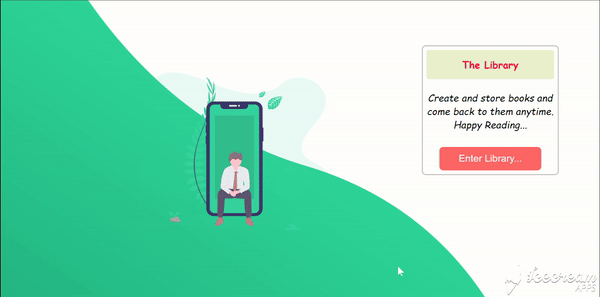

[![Contributors][contributors-shield]][contributors-url]
[![Forks][forks-shield]][forks-url]
[![Stargazers][stars-shield]][stars-url]
[![Issues][issues-shield]][issues-url]
[![MIT License][license-shield]][license-url]

# Project Library
 

  

  <h3 align="center">
    A project from the Microverse Javascript Curriculum
  </h3>

  <h3 align="center">
	 Live Version link - https://mikenath223.github.io/Project-Library/
  </h3>

  

 A Library Project for Microverse. Its also part of the <a href="https://www.theodinproject.com/courses/ruby-on-rails/lessons/final-project">Odin project curriculum.</a>
     

  

## Project A Library App
This is a Library App where you can display, add and remove your books. You can use this to keep track of your reading list, and check all your completed books.

## Snapshot

# Validations

- ESLint

# Get Started

Download or clone this [repo here](https://github.com/mikenath223/Project-Library) and open the 'index.html. file.

# Built With

This project was built with these techologies:

* JavaScript
* HTML
* CSS

# Authors

**Michgolden Ukeje**

- Github: [@mikenath223](https://github.com/mikenath223)
- Twitter: [@Michgolden_Nath](https://twitter.com/MichgoldenU)
- Linkedin: [Ukeje Michgolden](https://https://www.linkedin.com/in/michgoldenukeje/)
 
 

**Alejandro Andres**

- Github: [@alexawesomecode](https://github.com/alexawesomecode)
- Twitter: [@alexcode0](https://twitter.com/alexcode0)
- Linkedin: [Alejandro Andres](https://www.linkedin.com/in/alejandro-andres-126592191/)

# License

This project is licensed under the MIT License - see the [LICENSE.md](LICENSE.md) file for details

<!-- ACKNOWLEDGEMENTS -->
## Acknowledgements
* [Microverse](https://www.microverse.org/)
* [The Odin Project](https://www.theodinproject.com/)

<!-- MARKDOWN LINKS & IMAGES -->
<!-- https://www.markdownguide.org/basic-syntax/#reference-style-links -->
[contributors-shield]: https://img.shields.io/github/contributors/mikenath223/Project-Library.svg?style=flat-square
[contributors-url]: https://github.com/mikenath223/Project-Library/graphs/contributors
[forks-shield]: https://img.shields.io/github/forks/mikenath223/Project-Library
[forks-url]: https://github.com/mikenath223/Project-Library/network/members
[stars-shield]: https://img.shields.io/github/stars/mikenath223/Project-Library
[stars-url]: https://github.com/mikenath223/Project-Library/stargazers
[issues-shield]: https://img.shields.io/github/issues/mikenath223/Project-Library
[issues-url]: https://github.com/mikenath223/Project-Library/issues
[license-shield]: https://img.shields.io/github/license/mikenath223/Project-Library
[license-url]: https://github.com/mikenath223/Project-Library/blob/master/LICENSE.txt
